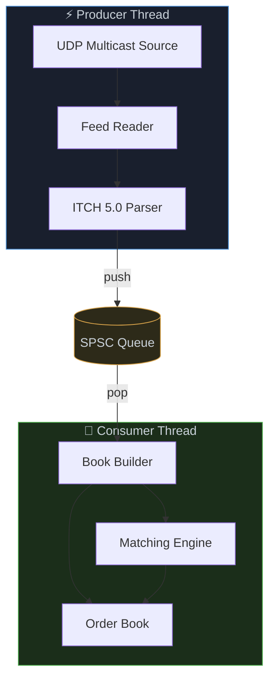

# fastbook

A low-latency market data processing system. Implements a full NASDAQ ITCH 5.0 pipeline in C++23: network feed ingestion, message passing via a lock-free queue, and an order book with a price-time priority matching engine.


---

## Architecture



---

## Modules

| Module | Description | Public API |
|--------|-------------|------------|
| **SPSC Queue** | Lock-free ring buffer connecting the producer and consumer threads. | `producer()` → `SPSCProducer`<br>`consumer()` → `SPSCConsumer`<br>`SPSCProducer::push(T)` → `bool`<br>`SPSCProducer::emplace(Args...)` → `bool`<br>`SPSCConsumer::pop()` → `optional<T>` |
| **Feed Handler** | A NASDAQ ITCH 5.0 parser. | `feed(span<const byte>)` |
| **Order Book** | Price-level book using sliding circular window. Orders at each level held in an intrusive doubly-linked list. | <br>`add_order(oid, shares, price, side)` → `bool`<br>`cancel_order(oid)` → `bool`<br>`execute_order(oid, executed_shares)` → `bool`<br>`reduce_order(oid, cancelled_shares)` → `bool`<br>`best_price(side)` → `uint32_t` |
| **Matching Engine** | A price-time priority matching engine. | `match(agg_order_id, side, price, qty, span<Fill>)` → `size_t` |
| **Slab Allocator** | Pre-allocated object pool with an intrusive free list. Eliminates heap allocation for order nodes on the hot path. | `allocate()` → `T*`<br>`deallocate(T*)` |
| **HashMap** | Open-addressing hash table with linear probing. Used for O(1) order lookup by ID. | `insert(key, value)` → `bool`<br>`find(key)` → `V`<br>`erase(key)` → `bool` |

---

## Build

```bash
# Release
cmake --preset release && cmake --build --preset release

# Debug + tests
cmake --preset debug -DBUILD_TESTS=ON
cmake --build --preset debug && ctest --preset debug
```

```bash
./build/release/bin/fastbook -f ./data/sample.itch
```

---

## Testing

| File | Module |
|------|--------|
| [`tests/test_spsc.cpp`](tests/test_spsc.cpp) | SPSC Queue |
| [`tests/test_hashmap.cpp`](tests/test_hashmap.cpp) | HashMap |
| [`tests/test_order_book.cpp`](tests/test_order_book.cpp) | Order Book |
| [`tests/test_matching_engine.cpp`](tests/test_matching_engine.cpp) | Matching Engine |
| [`tests/test_feed_handler.cpp`](tests/test_feed_handler.cpp) | Feed Handler |

---

## Project structure

```
fastbook/
├── src/
│   ├── main.cpp
│   ├── spsc/
│   │   └── spsc_queue.hpp
│   ├── orderbook/
│   │   ├── hash_map.hpp
│   │   ├── slab_allocator.hpp
│   │   └── order_book.hpp
│   ├── matching/
│   │   └── matching_engine.hpp
│   ├── feed/
│   │   ├── itch_messages.hpp
│   │   └── feed_handler.hpp
│   ├── feedreader/
│   │   └── feed_reader.hpp
│   ├── datasources/
│   │   ├── udp_source.hpp
│   │   └── file_source.hpp
│   └── bookbuilder/
│       └── book_builder.hpp
├── tests/
│   ├── test_spsc.cpp
│   ├── test_hashmap.cpp
│   ├── test_order_book.cpp
│   ├── test_matching_engine.cpp
│   └── test_feed_handler.cpp
└── bench/
    └── bench_spsc.cpp
    └── bench_order_book.cpp
```
